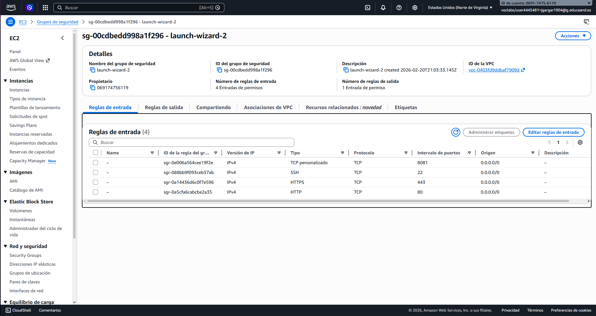
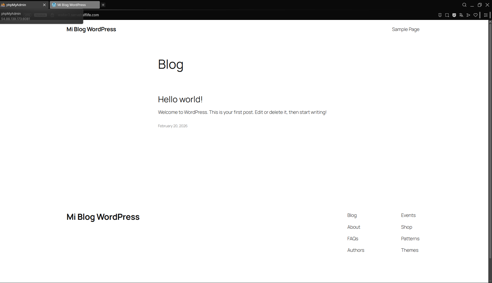

# Despliegue de WordPress con Docker y Docker Compose en AWS

## 1. Creación de la instancia EC2 en AWS

Se creó una instancia EC2 con las siguientes características:

- **AMI:** Ubuntu Server 22.04 LTS
- **Tipo de instancia:** t2.small
- **Almacenamiento:** 20 GB (gp2)
- **Grupo de seguridad:** Se abrieron los puertos 22 (SSH), 80 (HTTP), 443 (HTTPS), 8080 (WordPress) y 8081 (phpMyAdmin)

## 2. Instalación de Docker y Docker Compose

Una vez conectado a la instancia por SSH:

```bash
ssh -i clave.pem ubuntu@<IP_PUBLICA>
```

### Instalar Docker

```bash
sudo apt update
sudo apt install -y ca-certificates curl gnupg lsb-release

sudo mkdir -p /etc/apt/keyrings
curl -fsSL https://download.docker.com/linux/ubuntu/gpg | \
  sudo gpg --dearmor -o /etc/apt/keyrings/docker.gpg

echo \
  "deb [arch=$(dpkg --print-architecture) signed-by=/etc/apt/keyrings/docker.gpg] \
  https://download.docker.com/linux/ubuntu \
  $(lsb_release -cs) stable" | \
  sudo tee /etc/apt/sources.list.d/docker.list > /dev/null

sudo apt update
sudo apt install -y docker-ce docker-ce-cli containerd.io docker-compose-plugin
```

### Añadir el usuario al grupo docker

```bash
sudo usermod -aG docker $USER
newgrp docker
```

### Verificar instalación

```bash
docker --version
docker compose version
```

---

## 3. Estructura del proyecto

```
proyecto-wordpress/
├── docker-compose.yml
└── .env
```

---

## 4. Configuración del archivo .env

El archivo `.env` centraliza todas las variables de entorno utilizadas en el `docker-compose.yml`:

```env
# MySQL
MYSQL_ROOT_PASSWORD=rootpassword
MYSQL_DATABASE=bitnami_wordpress
MYSQL_USER=bn_wordpress
MYSQL_PASSWORD=bitnami

# WordPress (bitnami)
WORDPRESS_DATABASE_HOST=mysql
WORDPRESS_DATABASE_NAME=bitnami_wordpress
WORDPRESS_DATABASE_USER=bn_wordpress
WORDPRESS_DATABASE_PASSWORD=bitnami
WORDPRESS_BLOG_NAME=Mi Blog WordPress
WORDPRESS_USERNAME=user
WORDPRESS_PASSWORD=bitnami
WORDPRESS_EMAIL=user@example.com

# HTTPS-Portal
DOMAINS=tudominio.com -> http://wordpress:8080
STAGE=production
```

### Servicio: mysql

```yaml
mysql:
  image: mysql
  restart: unless-stopped
  environment:
    MYSQL_ROOT_PASSWORD: ${MYSQL_ROOT_PASSWORD}
    MYSQL_DATABASE: ${MYSQL_DATABASE}
    MYSQL_USER: ${MYSQL_USER}
    MYSQL_PASSWORD: ${MYSQL_PASSWORD}
  volumes:
    - mysql_data:/var/lib/mysql
  networks:
    - backend-network
  healthcheck:
    test: ["CMD", "mysqladmin", "ping", "-h", "localhost", "-u", "root", "-p${MYSQL_ROOT_PASSWORD}"]
    interval: 10s
    timeout: 5s
    retries: 5
```

El `healthcheck` verifica que MySQL esté listo antes de que WordPress intente conectarse.

### Servicio: wordpress

```yaml
wordpress:
  image: bitnami/wordpress
  restart: unless-stopped
  depends_on:
    mysql:
      condition: service_healthy
  environment:
    WORDPRESS_DATABASE_HOST: ${WORDPRESS_DATABASE_HOST}
    ...
  networks:
    - frontend-network
    - backend-network
  ports:
    - "8080:8080"
```

Usa `depends_on` con `condition: service_healthy` para esperar a que MySQL pase el healthcheck.

### Servicio: phpmyadmin

```yaml
phpmyadmin:
  image: phpmyadmin/phpmyadmin
  restart: unless-stopped
  depends_on:
    mysql:
      condition: service_healthy
  environment:
    PMA_HOST: mysql
    PMA_PORT: 3306
  networks:
    - frontend-network
    - backend-network
  ports:
    - "8081:80"
```

### Servicio: https-portal

```yaml
https-portal:
  image: steveltn/https-portal
  restart: unless-stopped
  depends_on:
    - wordpress
  environment:
    DOMAINS: ${DOMAINS}
    STAGE: ${STAGE}
  networks:
    - frontend-network
  ports:
    - "80:80"
    - "443:443"
```

Gestiona automáticamente los certificados SSL mediante Let's Encrypt.

### Política de reinicio

Todos los servicios usan `restart: unless-stopped`, lo que garantiza que se reinicien automáticamente si se detienen de forma inesperada, excepto si se han parado manualmente.

---

## 6. Despliegue y verificación

### Crear el directorio y los archivos

```bash
mkdir proyecto-wordpress && cd proyecto-wordpress
nano docker-compose.yml   # Pegar el contenido del archivo
nano .env                 # Pegar el contenido del archivo
```

### Iniciar los servicios

```bash
docker compose up -d
```

### Verificar que los contenedores están en ejecución

```bash
docker compose ps
```
---

## 7. Configuración de HTTPS con https-portal

### Requisitos previos

- Tener un dominio registrado (por ejemplo en Namecheap, GoDaddy, etc.).
- Crear un registro DNS de tipo **A** apuntando el dominio a la IP pública de la instancia EC2.

### Configurar el .env

```env
DOMAINS=walter3.servehalflife.com -> http://wordpress:8080
STAGE=production
```

> Para pruebas sin dominio real, se puede usar `STAGE=local`, que genera un certificado autofirmado.

### Reiniciar los servicios

```bash
docker compose down
docker compose up -d
```

https-portal obtendrá automáticamente el certificado SSL de Let's Encrypt y redirigirá el tráfico HTTPS al contenedor de WordPress.




